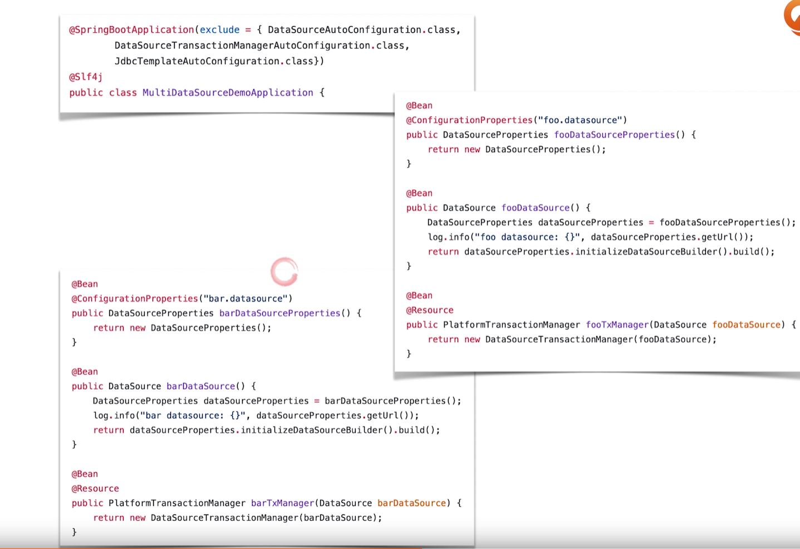
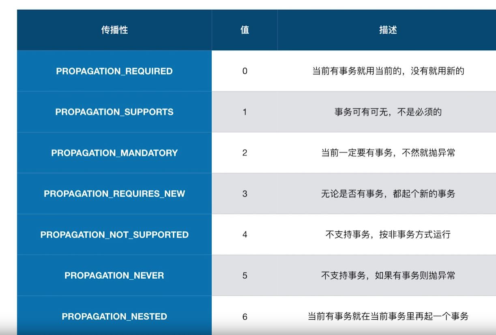
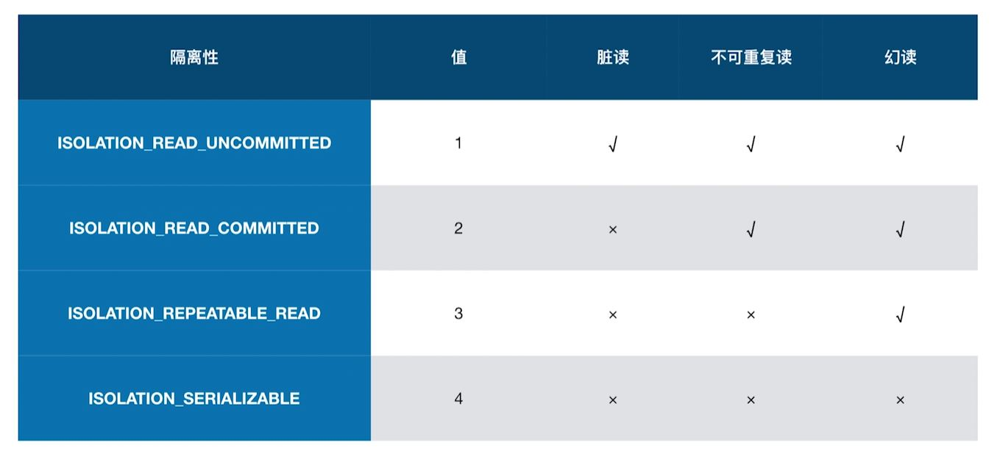
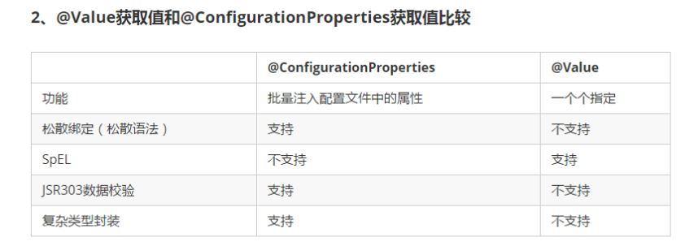
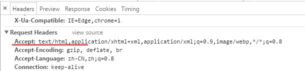
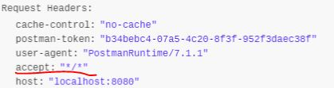
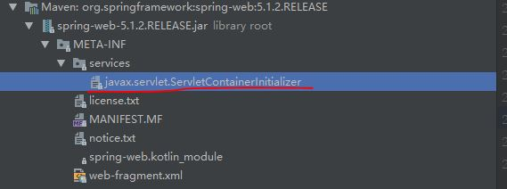
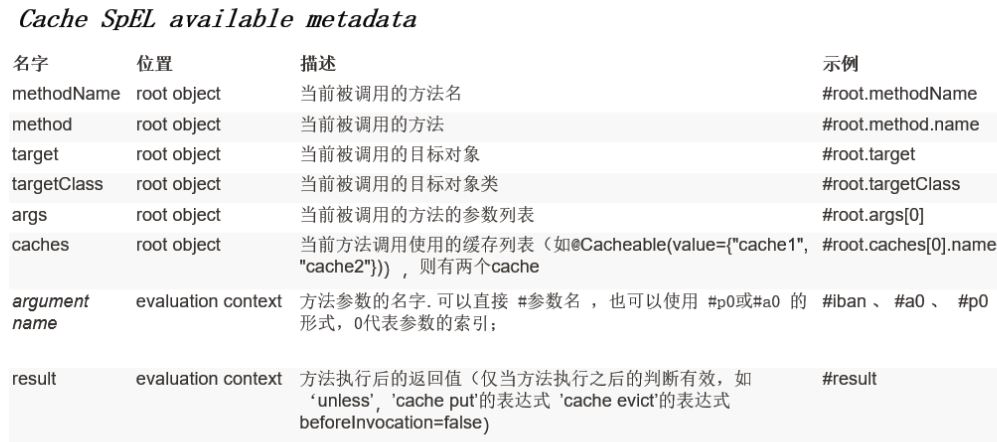

## Spring Boot

1. 监控（JMX）
    - health
        - http://localhost:8080/actuator/health
    - 通过Web查看beans
        - application.properties增加management.endpoints.web.exposure.include=*
        - 访问http://localhost:8080/actuator/beans
    - mappings
        - http://localhost:8080/actuator/mappings
    - env
        - http://localhost:8080/actuator/env

2. Datasource配置
    - DataSourceAutoConfiguration
        - DataSource
    - DataSourceTransactionManagerAutoConfiguration
        - DataSourceTransactionManager(implements PlatformTransactionManager)
    - JdbcTemplateAutoConfiguration
        - JdbcTemplate
    
3. 配置多数据源
    - 方式一：增加@Primary注解
    - 方式二：排除自动配置
        - DataSourceAutoConfiguration
        - DataSourceTransactionManagerAutoConfiguration
        - JdbcTemplateAutoConfiguration

    
4. 属性参数列表
    - spring-boot-autoconfigure-2.2.0.M1.jar!/META-INF/spring-configuration-metadata.json

5. @Resource VS @Autowired
    - @Autowired按byType自动注入，而@Resource默认按 byName自动注入
    
6. Hikaricp
    - 字节码级别优化，通过JavaAssist生成(Javaassist 就是一个用来处理 Java 字节码的类库)
    - 大量小改进
        - FastList代替ArrayList
        - 无锁集合ConcurrentBag
        - 代理类的优化，invokestatic代替了invokevirtual
    
7. 事务
    - PlatformTransactionManager
        - DataSourceTransactionManager
            - TransactionDefinition
                - Propagation
                - Isolation
                - TimeOut
                - Read-only status
            - TransactionStatus
        
    
        
    

    - 编程式事务
        - TransactionTemplate
        - DataSourceTransactionManager
    - 申明式事务
        - @EnableTransactionManagement在spring boot中在TransactionAutoConfiguration中自动装配    

8. 配置Mybatis数据源
    - DataSource
        - HikariDataSource
    - SqlSessionFactory
        - SqlSessionFactoryBean.getObject();
    - PlatformTransactionManager
        - DataSourceTransactionManager(DataSource)
    - SqlSessionTemplate(SqlSessionFactory)

9. AOP   
    - DefaultAopProxyFactory implements AopProxyFactory(创建Aop)   
        - JdkDynamicAopProxy implements AopProxy   
        - ObjenesisCglibAopProxy implements AopProxy   
    - `@EnableAspectJAutoProxy` 在spring boot中在AopAutoConfiguration中自动装配
        - proxyTargetClass
        - exposeProxy 如果true，放入ThreadLocal，可以通过AopContext来获取   
    - AbstractAutoProxyCreator.postProcessBeforeInstantiation -> AspectJAwareAdvisorAutoProxyCreator.createProxy -> proxyFactory.getProxy
        
10. 数据库错误码解析 SQLErrorCodeSQLExceptionTranslator
    - 错误码定义：spring-jdbc-5.1.2.RELEASE.jar/org/springframework/jdbc/support/sql-error-codes.xml
    - sql-error-codes.xml注册自定义的CustomSQLErrorCodesTranslation

11. JPA
    - Java persistence API

12. Logback
    - AbstractLoggingSystem#initializeWithConventions 检测装载了哪个配置文件

13. @ConfigurationProperties VS @Value   
    

14. @PropertySource(value = {"classpath:application.properties"}) 加载额外属性文件

15. @ImportResource(value = {"classpath:beans.xml"}) 加载额外配置文件

16. Profiles
    - `--spring.profiles.active=dev` 程序参数
    - `-Dspring.profiles.active=dev` JVM参数
    - spring.profiles.active=dev 配置文件参数

17. `--spring.config.location=` 指定配置文件，互补配置

18. @PropertySource 不支持YAML，只支持properties， 但可以定制MixPropertySourceFactory
19. @TestPropertySource(value = {"classpath:externalized-config.properties"}) 只支持properties
20. @EnableConfigurationProperties // 相当于@Configuration或者 @Component + @ConfigurationProperties(prefix = "person")， bean name 不确定
21. application.yml定义debug=true调试自动装配依赖
22. logback-spring.xml VS logback.xml
    - 可以和<springProfile name="uat" />进行配合使用
    
23. WebMvcAutoConfiguration
    - addResourceHandlers (https://www.webjars.org/) 定义web资源和静态文件 ResourceProperties
    - welcomePageHandlerMapping 定义首页 ResourceProperties
    - FaviconConfiguration 定义图标
    - @ConditionalOnMissingBean(WebMvcConfigurationSupport.class)
        - addDefaultHttpMessageConverters 配置Converters
        - 重写这个方法getMessageConverters#extendMessageConverters，可以手动替换MessageConverter
     
24. thymeleaf
    - 可根据<properties/>切换版本
    
25. jsp
    - DispatcherServlet#processDispatchResult->#render
    - UrlBasedViewResolver#buildView
    - java/resources/webapp在一层
    - war包根是webapp下面一层
    
26. ViewResolver 视图解析器， 返回View对象
    - ContentNegotiatingViewResolver#resolveViewName解析视图, 组合所有的视图解析器。
    
27. DispatcherServlet
    1. FrameworkServlet#service(ServletRequest req, ServletResponse res)
    2. DispatcherServlet#doService->doDispatch->render

28. Converter, Formatter

29. 实现WebMvcConfigurer，来扩展Spring MVC 的功能
    - 例子
    ```text
    @Configuration
    public class MyMvcConfig implements WebMvcConfigurer {
        @Override
        public void addViewControllers(ViewControllerRegistry registry) {
            registry.addViewController("/ss").setViewName("success");
        }
    }
    ```
    - 原理：
        - WebMvcAutoConfigurationAdapter#EnableWebMvcConfiguration#DelegatingWebMvcConfiguration#setConfigurers注册Configurers到WebMvcConfigurerComposite
        - 遍历WebMvcConfigurerComposite调用WebMvcConfigurer的方法
        - 不需要@EnableWebMvc，使用此注解，则spring boot自动装配失效，完全手动配置（WebMvcAutoConfiguration中配置的bean都没有注册到容器中）

30. ResourceBundleMessageSource 国际化
    - MessageSourceAutoConfiguration#messageSource
    - MessageSourceProperties
    - LocaleResolver/Locale (WebMvcAutoConfiguration#localeResolver) bean名字一定要是localeResolver, 和源码保持一致
        - WebMvcAutoConfiguration#localeResolver
        - http://localhost:8080/success （Accept-Language: zh-CN,zh;q=0.9,en-US;q=0.8,en;q=0.7）
    
31. ThymeleafAutoConfiguration
    - ThymeleafProperties#DEFAULT_PREFIX
    - ThymeleafProperties#DEFAULT_SUFFIX
    
32. Model/ModelAndView/Map/ModelAndView 都可放在请求域中
33. ThymeleafViewResolver
    - REDIRECT_URL_PREFIX
    - FORWARD_URL_PREFIX
    - createView
    
34. Servlet
    - HttpServletResponse#sendRedirect(); 两次请求，所以地址变化
    - HttpServletRequest#getRequestDispatcher#forward(request,response); 一次请求，所以地址不变
    
35. Put方式
    - HiddenHttpMethodFilter 转变请求方式，因为表单提交只支持get/post, 不支持put/delete/patch

36. redirect VS forward
    - form表单：可以采用post或者get请求，客户端主动跳转，url地址会改变为提交后的地址
    - forward：forward是转发请求，不转发地址。服务器直接访问目标地址，把目标地址响应内容读取过来，然后再发送到客户端，客户端浏览器根本不知道服务器的内容是从其他的目标地址获取的，客户端url地址也不会改变。forward不但转发请求内容，还把请求的方式也转发了，所以forward的请求是get还是post取决于启用forward的源请求是post方式还是get方式，如：a.jsp 以 post 方式调b.jsp，那么b.jsp 以forward的方式访问c.jsp也会以post方式访问。
    - redirect：redirect是通过服务端向客户端发送状态码，在客户端跳转url，redirect都是get的方式请求，而且url地址会跳转到目标地址
    - redirect会进行两次request和两次response，并且地址和参数都被暴露出来，forward只会进行一次请求，效率更高而且可以隐藏信息

37. ErrorMvcAutoConfiguration
    - errorAttributes (DefaultErrorAttributes) 存放共享信息，给DefaultErrorViewResolver使用
    - basicErrorController (BasicErrorController) 处理error请求 （@RequestMapping("${server.error.path:${error.path:/error}}")）
        - errorHtml 产生HTML数据    
        
        - error 产生json数据     
         
    - errorPageCustomizer (ErrorPageCustomizer) 系统出现错误以后，来到error请求进行处理(@Value("${error.path:/error}"))
    - DefaultErrorViewResolverConfiguration#conventionErrorViewResolver (DefaultErrorViewResolver)
        - 有模板引擎的情况下，在模板引擎根路径下建立error/404
        - 没有模板引擎情况下，在静态资源文件夹下static/error/404.html
        - 以上都没有，走默认Spring Boot错误页面 new ModelAndView("error", model);

38. MVC调用流程
    - DispatcherServlet#doService->#doDispatch
    - RequestMappingHandlerAdapter#handle->#handleInternal->#invokeHandlerMethod(modelFactory.initModel)
    - ServletInvocableHandlerMethod#invokeAndHandle
    - InvocableHandlerMethod#invokeForRequest
    - HandlerMethodReturnValueHandler 遍历获取HandlerMethodReturnValueHandler
        - RequestResponseBodyMethodProcessor#handleReturnValue -> HttpMessageConverter
        - ViewNameMethodReturnValueHandler

39. 主要类    
    - ModelAndViewContainer
    - RequestMappingHandlerMapping

40. @ControllerAdvice
    
41. 嵌入式Servlet容器
    - 修改server有关的配置(ServerProperties)
        - server.port=8081
        - server.servlet.context-path=/crud
        - server.tomcat.uri-encoding=UTF-8
    - ServletWebServerFactoryAutoConfiguration
        - WebServerFactoryCustomizer 通过WebServerFactoryCustomizerBeanPostProcessor#postProcessBeforeInitialization进行遍历
            - customize

42. 注册Servlet三大组件
    - Servlet (ServletRegistrationBean)
    - Filter (FilterRegistrationBean)
    - Listener (ServletListenerRegistrationBean)
        - ServletContextListener
    
43. DispatcherServletAutoConfiguration
    - DispatcherServletRegistrationBean
    
44. Servlet容器
    - Tomcat （默认 ）
    - Jetty
    - Undertow
    
45. 内嵌容器自动化配置原理
    - ServletWebServerFactoryAutoConfiguration
        - ServletWebServerFactoryConfiguration.EmbeddedTomcat.class
            - AbstractApplicationContext#refresh -> #onRefresh -> ServletWebServerApplicationContext#createWebServer -> TomcatWebServer#initialize -> Tomcat#start
            - ServletWebServerApplicationContext#finishRefresh -> #startWebServer (备用)
       - ServletWebServerFactoryConfiguration.EmbeddedJetty.class
       - ServletWebServerFactoryConfiguration.EmbeddedUndertow.class
       
46. ApplicationContext
    - AnnotationConfigApplicationContext
    - ClassPathXmlApplicationContext
    - AnnotationConfigServletWebServerApplicationContext
    - XmlServletWebServerApplicationContext
    
47. Tomcat
    - 内置（可执行jar）
        - 优点： 简单，便携
        - 默认不支持JSP，优化订制比较复杂 （ServerProperties，ServletWebServerFactoryCustomizer， TomcatServletWebServerFactory）
    - 外置（war包）
        - 只能直接访问webapp下的jsp，不能访问WEB-INF下的
        - 必须实现SpringBootServletInitializer#configure
    - 原理
        - jar包：执行SpringBoot主类的main方法，启动IOC容器，创建嵌入式的Servlet容器
        - war包：启动服务器，服务器启动SpringBoot应用[SpringBootServletInitializer], 启动IOC容器
            - servlet 3.0 规范 （8.2.4 Shared libraries/runtimes pluggability）
                - 服务器web应用启动，会创建当前web应用里面每一个jar包里面的ServletContainerInitializer的实现类的实例
                - ServletContainerInitializer的实现放在jar包的META-INF/services文件夹下，有一个名为javax.servlet.ServletContainerInitializer的文件，内容就是ServletContainerInitializer的实现类的全类名
                - 还可以使用`@HandlesTypes`，在应用启动的时候加载我们感兴趣的类
    - 流程
        1. 启动Tomcat
        2. 在所有jar下，寻找META-INF/services文件夹下ServletContainerInitializer -> org.springframework.web.SpringServletContainerInitializer
            
        3. SpringServletContainerInitializer将`@HandlesTypes(WebApplicationInitializer.class)`标注的类型的类传入到#onStartup方法的`Set<Class<?>> webAppInitializerClasses`, 为WebApplicationInitializer类型的类创建实例
            - 相当于SpringBootServletInitializer的类会被创建对象，并执行onStartup方法
        4. 每一个WebApplicationInitializer都调用自己的onStartup (SpringBootServletInitializer#onStartup)
        5. SpringBootServletInitializer实例执行onStartup的时候，会调用#createRootApplicationContext创建容器
            - 调用`configure`方法
            - 创建SpringApplication
            - 启动Spring应用
    
48. 读属性文件
    - PropertySourceLoader
        - PropertiesPropertySourceLoader
        - YamlPropertySourceLoader
    - ResourceLoader
        - DefaultResourceLoader
        - PathMatchingResourcePatternResolver
        
49. Docker
    - docker主机（Host）：安装了docker程序的机器
    - docker客户端（Client），连接docker主机进行操作
    - docker仓库（Registries/Repository），保存各种打包好的软件镜像
    - docker镜像（Image）, 软件打包好的镜像，放在docker仓库中
    - docker容器（Container），镜像启动后的实例称为一个容器，容器是独立运行的一个或一组应用
    
50. Docker Command
    - `uname -r` (内核必须3.10以上版本，3.10.0-693.el7.x86_64)
    - `yum update` 升级内核
    - `yum install docker` 安装docker
    - `systemctl start docker` 启动docker 
    - `systemctl stop docker` 停止docker
    - `docker -v` 查看docker 版本号，Docker version 1.13.1, build 774336d/1.13.1
    - `systemctl enable docker` docker开机启动
    - `docker search mysql` 去docker hub搜索
    - `docker pull mysql:5.5` 拉取tag 5.5镜像
    - `docker images` 查看所有镜像
    - `docker rmi imageID` 删除镜像
    - `docker run --name mytomcat -d -p 主机端口:容器端口 hub.c.163.com/library/tomcat:latest` 启动容器
    - `docker ps -a` 查看所有运行过的容器
    - `docker stop containerID/containerName` 停止容器
    - `docker start containerID/containerName` 启动容器
    - `docker rm containerID` 删除容器
    - `docker logs containerID/containerName` 查看容器日志
    - `docker exec -it mysql01 /bin/bash` 进入容器

51. MySQL docker
    - `docker run -p3306:3306 --name mysql01 -e MYSQL_ROOT_PASSWORD=123456 -d mysql`
    - `docker exec -it mysql01 /bin/bash`
    - MySQL 8.0会有caching-sha2-password问题
        ```text
        mysql -uroot -p123456
        use mysql;
        #修改加密规则 
        ALTER USER 'root'@'%' IDENTIFIED BY '123456' PASSWORD EXPIRE NEVER; 
        #更新密码（mysql_native_password模式）
        ALTER USER 'root'@'%' IDENTIFIED WITH mysql_native_password BY '{123456}';
        flush privileges;
        ```
52. 数据库DataSourceAutoConfiguration
    - DataSourceConfiguration
        - `org.apache.tomcat.jdbc.pool.DataSource`
        - `com.zaxxer.hikari.HikariDataSource`
        - `org.apache.commons.dbcp2.BasicDataSource`
        - 自定义数据源
    - DataSourceInitializationConfiguration
        - DataSourceInitializerInvoker (ApplicationListener <- EventListener) 运行建表语句和sql语句（`schema-*.sql`，`data-*.sql`）
            - DataSourceInitializer
    - 初始化表, 默认只支持内嵌数据源，必须设置initialization-mode: always
        ```yaml
        spring:
          datasource:
            username: root
            password: 123456
            url: jdbc:mysql://192.168.1.151:3306/jdbc?useSSL=false&allowMultiQueries=true
            driver-class-name: com.mysql.cj.jdbc.Driver
            initialization-mode: always
            schema:
              - classpath:department.sql

       ```

53. JdbcTemplateAutoConfiguration
    - 自动配置了JdbcTemplate操作数据库
    
54. SpringData JPA（Object Relational Mapping）
    - 编写一个实体类（bean）和数据表进行映射， 并标注@Entity
    - 编写一个Dao接口来操作实体类对应的表（Repository）, 并标注@Repository
    - 基本配置
        ```yaml
          jpa:
            hibernate:
            # 更新或创建数据表
              ddl-auto: update
            # 控制台显示SQL
            show-sql: true
        ```
     - 指定扫包
        - 方案一、把 @SpringBootApplication 注解的 SpringBoot 入口类移到上层 root 包中，使 JpaRepository 子接口位于 root 包及其子包中。
        - 方案二、在 SpringBoot 入口类上添加
            1. @ComponentScan(basePackages = "xxx.xxx.xxx")：扫描 @Controller、@Service 注解；
            2. @EnableJpaRepositories(basePackages = "xxx.xxx.xxx")：扫描 @Repository 注解；如果开发过程当中使用到了MongoRepository的话，就需要增加@EnableMongoRepositories注解。
            3. @EntityScan(basePackages = "xxx.xxx.xxx")：扫描 @Entity 注解；

55. Spring Boot 启动配置原理
    - 关键接口
        - ApplicationContextInitializer
        - SpringApplicationRunListener
        - ApplicationRunner
        - CommandLineRunner
    - 启动流程
        1. 创建SpringApplication对象
            - setInitializers
                - 从类路径下找到META-INF/spring.factories配置的所有ApplicationContextInitializer，保存起来
            - setListeners
                - 从类路径下找到META-INF/spring.factories配置的所有ApplicationListener，保存起来
            - 从多个配置类中找到有main方法的主配置类
        2. 运行run方法
            - 从类路径下找到META-INF/spring.factories配置的所有SpringApplicationRunListener，保存起来 
            - 回调所有的SpringApplicationRunListener#starting
            - 回调所有的SpringApplicationRunListener#environmentPrepared
            - 创建ApplicationContext，决定创建web的IOC还是普通的IOC
            - 准备上下文环境，将Environment保存到IOC中，而且applyInitializer();回调ApplicationContextInitializer#initialize
            - 回调SpringApplicationRunListener#contextPrepared
            - 回调SpringApplicationRunListener#contextLoaded
            - refreshContext刷新容器，扫描所有组件，创建对象
            - afterRefresh调用IOC容器中的ApplicationRunner、CommandLineRunner
            - 回调SpringApplicationRunListener#running
            - 启动完成，返回IOC，ApplicationContext
    
56. 自定义starter
    - `@Configuration`指定配置类
    - `@ConditionalOnxxx` 在条件成立的情况下，自动配置类生效
    - `@AutoConfigurexxx` 指定自动配置类的加载顺序
    - `@Bean` 给容器中添加组件
    - `@EnableConfigurationProperties`使用`@ConfigurationProperties`结合相关的xxxProperties类来绑定相关的配置，加入到容器中
    - 在META-INF/spring.factories中配置org.springframework.boot.autoconfigure.EnableAutoConfiguration
    - 模式
        - 启动器只用来做依赖导入
        - 专门写一个自动配置模块
        - 启动器依赖自动配置， 别人只需要引入启动器（starter）
        - 自定义启动器名：xxx-spring-boot-starter
        - 不能使用spring-boot-maven-plugin，此插件会要求main-class
        
57. 缓存
    - CachingProvider 管理CacheManager
    - CacheManager 管理Cache
    - Cache 包含很多Entry
    - Entry 每一条记录
    - Expiry 过期时间
    - `@Cacheable` 标注结果要缓存，如果缓存有，就从缓存拿
    - `@CacheEvict` 清空缓存
    - `@CachePut` 更新缓存
    - `@EnableCaching` 开启注解的缓存
    - KeyGenerator 缓存数据时Key生成策略
    - Serialize  缓存数据时Value序列化策略
    
58. 使用缓存
    - `@EnableCaching` 开启基于注解的缓存
    - `@Cacheable` 标注结果要缓存，如果缓存有，就从缓存拿
        - cacheNames/value: 指定缓存名字
        - key: 缓存数据时的key，默认使用方法参数的值，比如：key->员工id1，value->方法返回值,可以使用SpEL (#root.args[0],#id)
           
        - keyGenerator: key的生成器，可以指定key的生成器的组件id，key和keyGenerator二选一
        - cacheManager: 缓存管理器， 或者CacheResolver, 二选一
        - condition: 指定符合条件下，才缓存
        - unless: 指定的条件为true，方法返回值就不会被缓存，和condition相反，获取到结果来判断
        - sync: 是否使用异步模式
    - `@CacheEvict` 清空缓存
    - `@CachePut` 更新缓存
    - `@Caching` 组合注解
    - `@CacheConfig` 缓存的公共配置
    
59. CacheAutoConfiguration
    - 默认： SimpleCacheConfiguration（ConcurrentMap ）
    - `@Cacheable`标注的方法执行之前先来检查缓存有没有这个数据，默认按照参数的值作为key去查询缓存，（如果没有参数，使用SimpleKey对象作为参数）如果没有，就运行目标方法，并将结果放入缓存
    - 原理：
        - 增加`@Cacheable`的方法的类会被解析为代理类，是通过代理实现的
        - CacheAspectSupport#execute
        
 60. 安装Redis和集成
    - https://c.163yun.com/hub#/m/home/
    - docker pull hub.c.163.com/library/redis:latest
    - docker run -d -p 6379:6379 --name myredis hub.c.163.com/library/redis
    - 引入starter：spring-boot-starter-data-redis
        - stringRedisTemplate (k-v 都是字符串)
        - redisTemplate （k-v 都是对象）默认使用jdk序列化保存
    