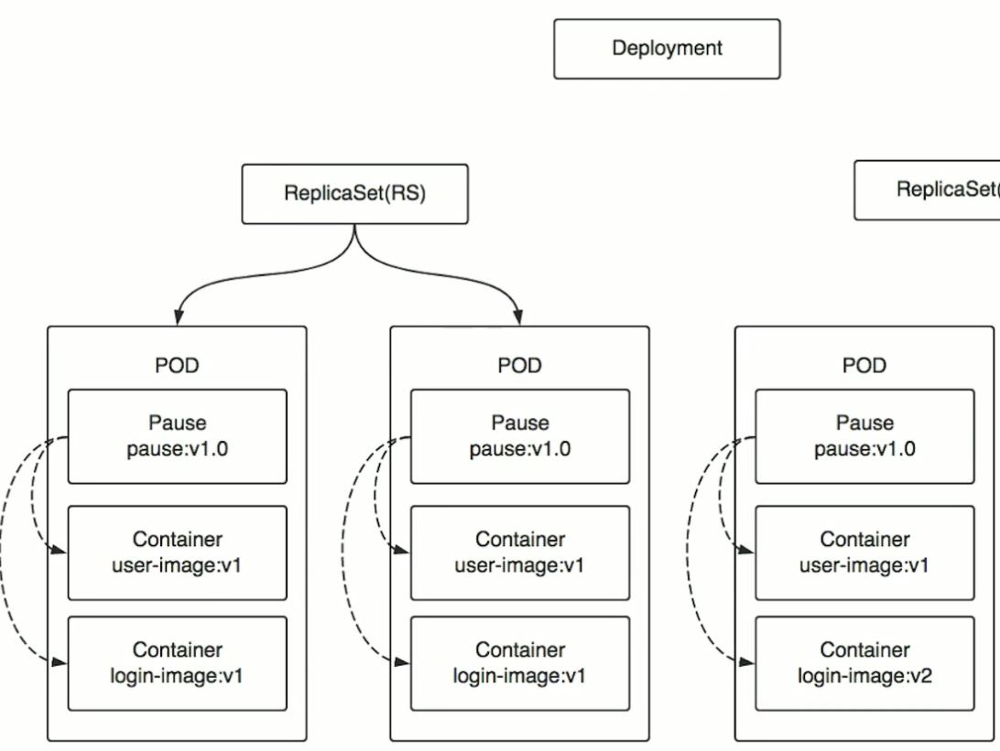
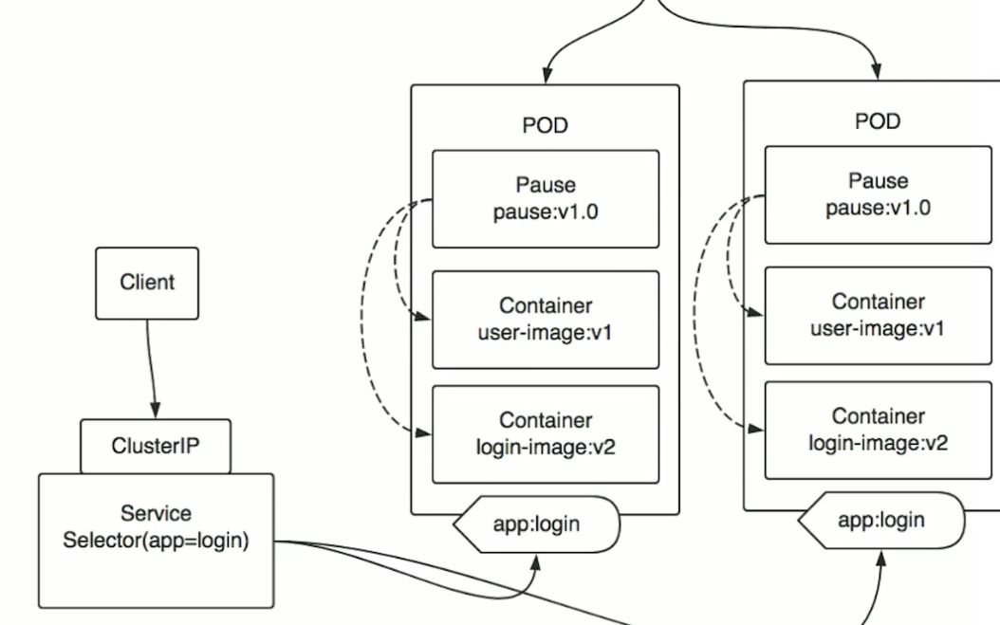
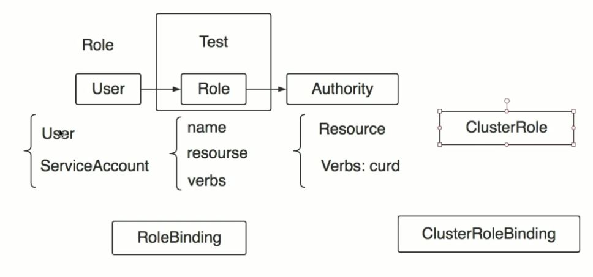
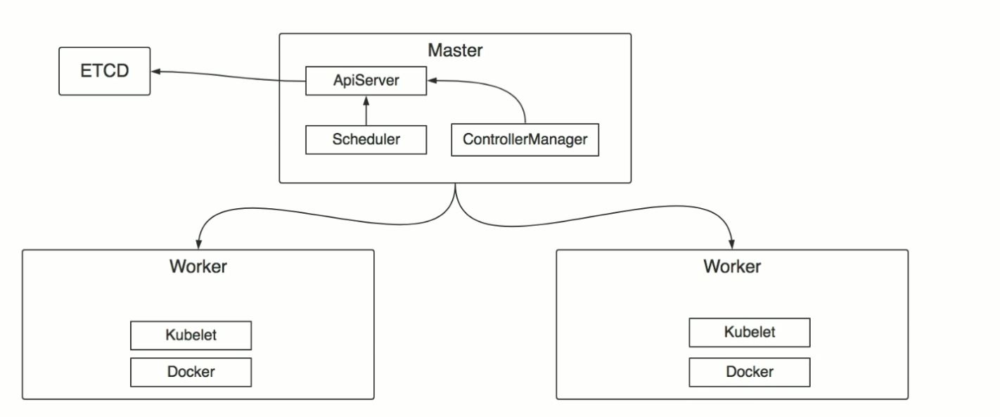

## Kubernetes

### 概念

- Pod： 
    - 包含一个或多个容器，这些容器都运行在一台机器上。
    - 多个容器共享网络
    - 有一个唯一IP
    - 一定有一个Pause容器，把其他容器都link在一起，并进行健康检查，汇报给K8s
    - 关系紧密的容器，可以放在一个Pod里
- ReplicaSet(RS)
    - 管理Pod
- Deployment
    - 管理RS （创建和销毁）
- Label
    - Deployment/Pod 都可以打标签，标识作用
- Service
    - Selector 指定使用的标签
    - ClusterIP 客户端使用ClusterIP访问service
    
- ETCD: 集群的存储组件
- APiServer：操作K8s唯一入口，对外提供http或https api
    - 认证: 认证了身份
    - 授权: 身份的人可以干什么 
        - ABAC
        - WebHook
        - RBAC（Role Based Access Control）
            - User -> Role -> Authority
            - User 
                - User (客户端Kubectl访问)， 可以赋Role，ClusterRole
                - ServiceAccount （内部访问ApiServer，比如：Pod），可以赋Role，ClusterRole
            - Authority
                - Resource 哪些资源可以访问
                - Verbs：curd 对资源可以进行哪些操作
            - Role
                - name
                - resource
                - verb
            - RoleBinding: 用户和Role Mapping关系
            - namespace: 对资源进行区分，因为资源属于不同namespace，也是对role进行进一步区分，完整命名：namespace下的role
            - ClusterRole 特殊的一种Role，因为有些组件不属于任何namespace，因此不能用Role，要用ClusterRole，也包括普通Role功能
                - name
                - Cluster资源或者普通resource
                - verb
            - ClusterRoleBinding： 用户和ClusterRole Mapping关系
             
            - AdmissionControl: 准入控制，相当于filter，请求过来需要经过这些filter

            
- Scheduler：收集work的详细信息，cpu、memory等。通过策略，选择一个最优结点，通知ApiServer
- ControllerManager 集群控制中心，维护K8s对象
    - ServiceController 管理Servcie
    - EndpointController 管理Pod
    - ReplicationController 管理副本
    - ResourceController 管理资源配额
- Kubelet
    - 在每一个worker结点上都存在
    - 维护Pod，底层是调用docker
    
- Kubectl 客户端
- K8s认证方式
    - TLS双向认证 （外部->内部ApiServer）
        - K8s中自己的CA会给所有组件发证书，当kubectrl和Apiserver进行通信时，都会通过CA对彼此进行认证。
    - Bearer Token （外部->内部ApiServer）如果要测试接口，首先要进行登录，登录成功会获得token信息，向api接口发送请求的时候必须带上这个token。
    - ServiceAccount（namespace，token，ca）（内部，Pod和ApiServer通信）
        - ServiceAcount 会被挂载在Pod中的文件系统中，应用可以通过读取指定目录中的文件，获取namespace，token，ca，然后就可以和Apiserver进行交互了。
- 加密
    - 对称加密：用同样的秘钥加密和解密
        - 性能高
    - 非对称加密： 用公钥加密，用私钥解密 （密钥对）
        - 性能低
    - 最佳实践：把公钥发给其他人，然后对对称秘钥进行非对称加密，这样就能实现安全的传递对称秘钥， 而无法被中间人破解。当获取后，用私钥解密获得对称秘钥， 最终通信内容可以用这个对称秘钥进行加密和解密。
        - SSL/TLS (Https)
    - CA: 证书认证的中间商，颁发证书。 为了避免公钥被截获，然后被串改，导致你收到的另一个公钥的情况。收到公钥的人会发给CA去确认其合法性。 因此，最安全的方式是公钥和私钥都是由CA给的，不是自己生成的。
    - TLS双向认证： 彼此获取到对方的公钥后，可以去CA进行认证，以确定彼此身份
- Session 认证过程
1. 用户向服务端发送验证信息（用户名、密码）。
2. 服务端验证成功就向用户返回一个sessionid，服务端保存了这个session_id对应的信息，写入用户的 Cookie。
3. 之后前端发出的每一次请求，都会通过Cookie，将session_id传回服务端，服务端收到session_id，找到对应的数据，由此得知用户的身份。

### 安装方案
- Kubeadm： 都使用pod去操作
    - Kubectl
    - Kubeadm
    - Kubelet
- Binary： 每个组件是个进程，一个个配置和启动
