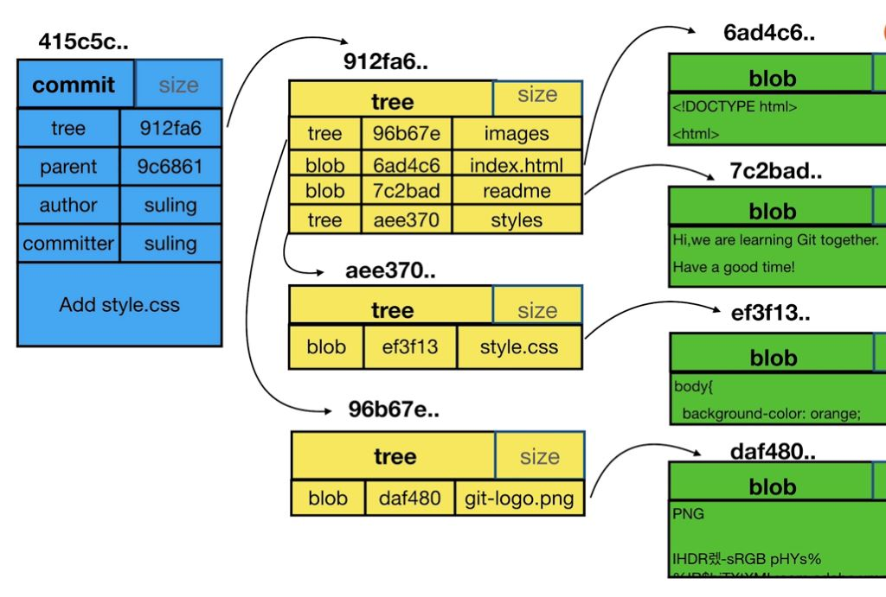
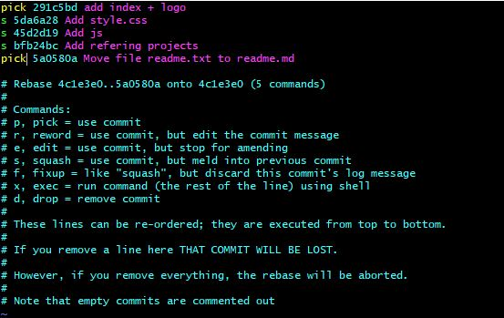
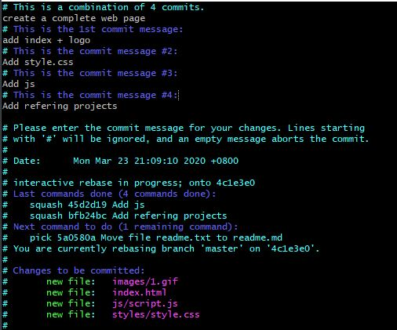
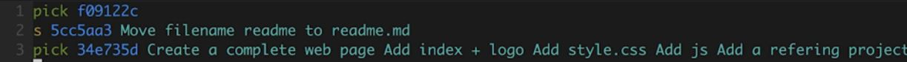

## Git

### 概念
- .git
    - HEAD 指向当前工作的分支引用
    - config 配置信息
    - refs 具体分支指向的commit信息
- git三大对象commit/tree/blob
    - git cat-file -p  5da6a28（commit id） 
    
- 分离头指针（detached head）不基于任何branch，而基于commit进行的开发和提交，切换分支时会被git删除。

### 操作
- 查看版本 git --version
- 配置user信息 git config --global user.name '' git config --global user.email ''
- 查看配置 git config -l --global
- 创建项目 git init your_project
    - cd /F/BigData/SpringBootLearning/projects/git_learning
    - 删除一个配置 git config --local --unset user.naem 
    - 添加文件到git git add readme.txt
    - 提交文件 git commit -m"Add readme"
- 查看本地branch信息 git branch -v
- 创建新的分支 git checkout -b temp 5da6a28a47c, git checkout -b temp master
- 切换分支 git checkout master
- 工作区直接提交到本地库 git commit -am"Add test"
- 查看日志 git log
    - 简洁版 git log -n4 --oneline
    - 图形版 git log --all --graph
    - 指定branch git log master
    - git图形化界面 gitk
- 查看git当前管理文件状态 git status
- 工作区中已经被git管理，且发生改变的文件一起添加到暂存区 git add -u
- 工作区已经被git管理的文件改名（暂存区或本地库） git mv readme.txt readme.md (快捷方式)
    1. mv readme.txt readme.md
    2. git add readme.md 
    3. git rm readme.txt
- 清理暂存区和工作区 git reset --hard
- 区域
    - 工作目录（区）
    - 暂存区 git add index.html images
    - 版本历史 git commit
- 查看git文件 git cat-file -t 59a4b3  git cat-file -p 59a4b3   （.git/objects/59）
- 比较两个commit的差异 git diff bfb24bc 5da6a28, git diff head head^, git diff head head~2  (当前和父亲的父亲比较)
- 删除分支 git branch -D temp
- 对最新一个commit的message进行变更 git commit --amend
- 对过去的commit的message进行变更 git rebase -i 5da6a28 （是需要变更的commit的上一个commit id） 
    - use commit 意思是commit内容仍然保留
    - reword commit内容仍然保留进行message修改
- 合并commit git rebase -i 4c1e3e0e
    
    
- 合并非连续的commit git rebase -i 4c1e3e0e，git rebase --continue
    
- 比较暂存区和本地库 git diff --cached
- 比较工作区和暂存区 git diff
    - 指定文件 git diff -- readme.md
### 