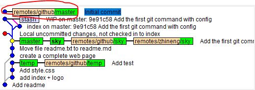

## Git

### 概念
- .git
    - HEAD 指向当前工作的分支引用
    - config 配置信息
    - refs 具体分支指向的commit信息
- git三大对象commit/tree/blob
    - git cat-file -p  5da6a28（commit id） 
    
- 分离头指针（detached head）不基于任何branch，而基于commit进行的开发和提交，切换分支时会被git删除。
- 协议
    - 本地协议 
        - 哑协议 `git clone --bare /f/BigData/SpringBootLearning/projects/git_learning/.git ya.git`
        - 智能协议(有进度条，压缩，传输更快) `git clone --bare file:///f/BigData/SpringBootLearning/projects/git_learning/.git zhineng.git`
    - http/https
    - ssh (不需要输入密码)
        - 秘钥 C:\Users\Administrator\.ssh
            - 生成 ssh-keygen -t rsa -b 4096 -C "XXX@qq.com"
            - 头像 -> settings -> SSH and GPG keys [github](https://github.com/settings/profile)
            - 贴公钥内容

### 操作
- 查看版本 git --version
- 配置user信息 git config --global user.name '' git config --global user.email ''
- 查看配置 git config -l --global
- 创建项目 git init your_project
    - cd /F/BigData/SpringBootLearning/projects/git_learning
    - 删除一个配置 git config --local --unset user.naem 
    - 添加文件到git git add readme.txt
    - 提交文件 git commit -m"Add readme"
- 查看本地branch信息 git branch -av  (-a列出本地和远端分支)
- 创建新的分支 git checkout -b temp 5da6a28a47c, git checkout -b temp master
- 切换分支 git checkout master
- 工作区直接提交到本地库 git commit -am"Add test"
- 查看日志 git log
    - 简洁版 git log -n4 --oneline
    - 图形版 git log --all --graph
    - 指定branch git log master
    - git图形化界面 gitk
- 查看git当前管理文件状态 git status
- 工作区中已经被git管理，且发生改变的文件一起添加到暂存区 git add -u
- 工作区已经被git管理的文件改名（暂存区或本地库） git mv readme.txt readme.md (快捷方式)
    1. mv readme.txt readme.md
    2. git add readme.md 
    3. git rm readme.txt
- 工作区删除文件直接放入暂存区 git rm readme.md
- 清理暂存区和工作区 git reset --hard, git reset --hard HEAD
    - 分支全部回滚到某个commit，这个commit之后的会被删除 git reset --hard 59a4b3
- 区域
    - 工作目录（区）
    - 暂存区 git add index.html images
    - 版本历史 git commit
- 查看git文件 git cat-file -t 59a4b3  git cat-file -p 59a4b3   （.git/objects/59）
- 比较两个commit的差异 git diff bfb24bc 5da6a28, git diff head head^, git diff head head~2  (当前和父亲的父亲比较)
- 删除分支 git branch -D temp
- 对最新一个commit的message进行变更 git commit --amend
- 对过去的commit的message进行变更 git rebase -i 5da6a28 （是需要变更的commit的上一个commit id） 
    - use commit 意思是commit内容仍然保留
    - reword commit内容仍然保留进行message修改
- 合并commit git rebase -i 4c1e3e0e
    
    
- 合并非连续的commit git rebase -i 4c1e3e0e，git rebase --continue
    
- 比较暂存区和本地库 git diff --cached
- 比较工作区和暂存区 git diff
    - 指定文件 git diff -- readme.md
- 比较工作区和Head git diff head
- 比较两个分支 git diff temp master -- index.html, git diff 4c1e3e0e 5da6a28 -- index.html
- 恢复暂存区（和Head一样）git reset HEAD -- file
    - 如果工作区没有相同文件，则状态退回到工作区
    - 如果工作区有相同文件，则清除暂存区，保留工作区文件
- 恢复工作区（和暂存区一样） git checkout -- readme.md
    - （和Head 一样， 暂存区也恢复） git checkout head -- readme.md
- 保存工作区和暂存区 git stash
    - 查看 git stash list
    - 应用 git stash apply/pop
- gitignore
    - [Java.gitignore](https://github.com/github/gitignore)  
- 远程库 
    - 查看远程库 git remote -v
    - 增加远程库 git remote add zhineng file:///f/BigData/SpringBootLearning/projects/git_learning_localremote/zhineng.git
        - git remote add github git@github.com:AK47Sonic/git_learning.git
    - 删除远程库 git remote rm zhineng
    - push远程库 git push --set-upstream zhineng sky, git push github -all
    - clone远程库(--bare 不需要工作区) git clone --bare file:///f/BigData/SpringBootLearning/projects/git_learning/.git zhineng.git
    - 远端分支拉到本地，但不做关联 git fetch github master
    
    - 
### 