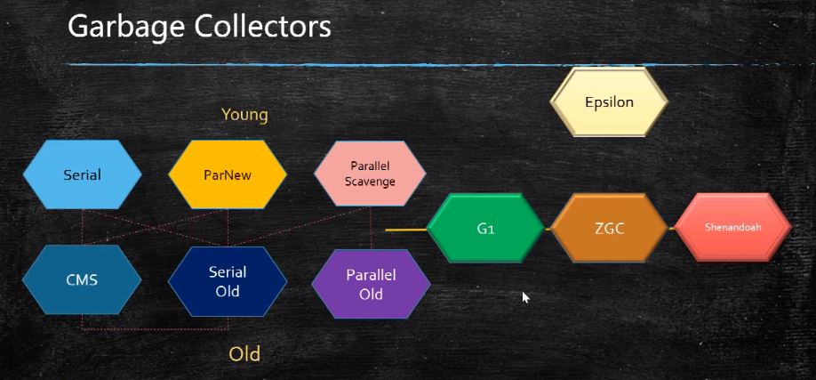
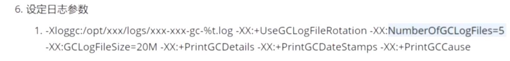
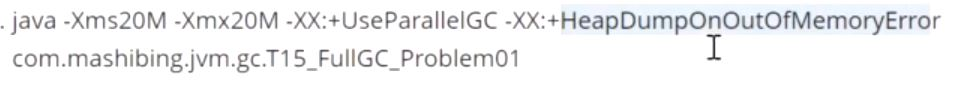

## JVM

### 定位垃圾
- 引用计数
- 根可达算法 （GC Roots 就是各种变量（本地变量，静态变量，常量池，JNI指针等））

### 垃圾回收算法
- Mark Sweep 标记清除 缺点：产生碎片
- Copying 复制  缺点：浪费空间
- Mark Compact 标记压缩  缺点：效率低

### 垃圾回收器分代模型
- 新生代
    - YGC回收之后，大部分的对象被回收，活着的进入S0
    - 再次YGC，活着的对象eden + S0 -》 S1
    - 再次YGC，活着的对象eden + S1 -》 S0
    - 年龄足够 -》 老年代 （15 CMS：6， 看垃圾回收器，年龄不同）
    - S区装不下 -》 老年代
- 老年代
- 永久代/元数据
    - class 对象
    - 永久代必须指定大小，元数据无上限（可设置，也可以不设置，受限于物理内存）
    - 1.7 字符串常量池在永久代，1.8在java堆
    - Method Area 逻辑概念： 永久代、元数据

### GC
- Full GC = YGC + Tenured GC
- 产生STW， stop the world， 停顿，清理压缩
- Minor GC 是 清理 新生代中的Eden区，Survivor区满时不会触发 ；
- Major GC 是 清理 老年代 ；
- Full GC 是 清理整个堆和方法区，包括 年轻代、老年代和方法区。

### 常见垃圾回收器
- Serial 串行回收
- Parallel Scavenge 并行回收
- ParNew 并行回收，为了配合CMS
- Serial Old
- Parallel Old
- CMS （Concurrent Mark Sweep） 减轻stw （200ms）
- G1（10ms）
- ZGC
- 默认垃圾收集器： Parallel Scavenge + Parallel Old

### JVM参数
- 标准： - 开头  java
- 非标准：-X 开头 java -X
- 不稳定：-XX 开头 
    - java -XX:+PrintFlagsFinal  
    - java -XX:+PrintFlagsInitial
    - java -XX:+PrintCommandLineFlags 观察java程序启动参数

### 实战
- -Xms -Xmx设置为一样，避免JVM动态扩容堆内存
- java -Xms200M -Xmx200M -XX:+PrintGC XXXXX
- jps 找到 PID
- top 看到 cpu memory
- jstack JVM各个线程的状况，检测死锁
- jinfo JVM参数
- jstat -gc 看gc状况
- jvisualvm 测试机器使用
- arthas
- jmap 分析内存
    - jmap -histo pid | head -20

### 对象（64位）
- mark world： 锁，gc，hashcode 信息
- class point: 指向类
- instance data 成员变量
- padding 对齐，补充满8字节的倍数

### Arthas调优
- java -jar arthas-boot.jar

- 堆转储
- Memory leak 对象占用内存但不释放
- Out of memory 很多Memory leak会导致内存溢出

### 僵尸进程和孤儿进程
- https://www.cnblogs.com/Anker/p/3271773.html

