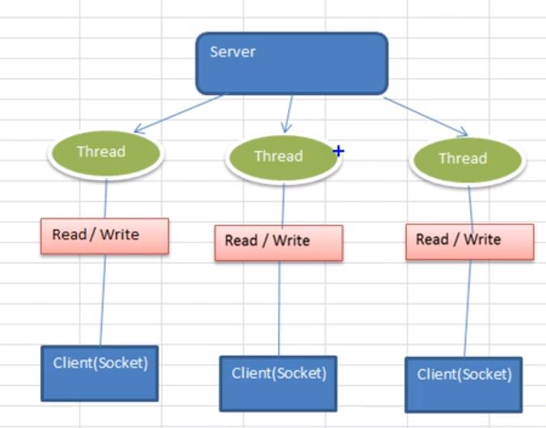
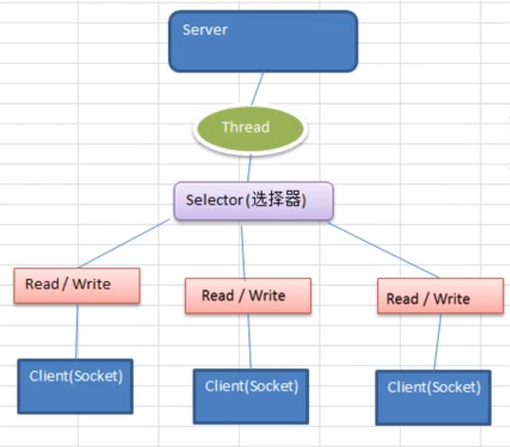
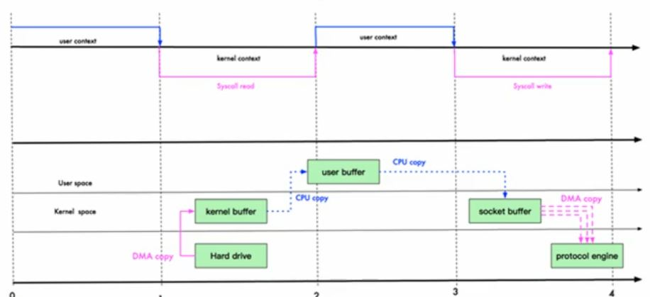

## Netty

### 简介
- Netty是异步，基于事件驱动的网络应用框架

### BIO、NIO、AIO
- IO模型
    - BIO：同步并阻塞(传统阻塞型)，服务器实现模式为一个连接一个线程，即客户端有连接请求时服务器端就需要启动一个线程进行处理，如果这个连接不做任何事情会造成不必要的线程开销 
    
        - serverSocket.accept();是阻塞的，当一个客户端连接时，才会获得一个socket连接
        - inputStream.read(bytes);是阻塞的，当获得数据时，才会下去，只有当telnet quit时，才会获得-1，所以在while(true)一直退出不了

    - NIO：同步非阻塞，服务器实现模式为一个线程处理多个请求(连接)，即客户端发送的连接请求都会注册到多路复用器上，多路复用器轮询到连接有I/O请求就进行处理
    
        - Channel 双向
            - FileChannel
            - ServerSocketChannel 和 SocketChannel
        - Buffer
            - 重要指标
                - capacity
                - limit （**读写的限制位**）
                - position
                - mark
            - 分类
                - MappedByteBuffer 直接操作堆外内存，性能较高
                - Buffer数组
                    - Scattering 将数据写到buffer数组
                    - Gathering 从buffer数组读数据
        - Selector 检测多个注册的通道上的是否有事件发生
            - 流程：
                1. ServerSocketChannel 在Selector上注册SelectionKey.OP_ACCEPT事件，是为建立客户端连接做准备
                2. 当selector.select获取到SelectionKey.OP_ACCEPT事件后，则可以通过accept创建SocketChannel
                3. SocketChannel在Selector上注册SelectionKey.OP_READ事件，是为有数据进出时做准备，可以读取或者写入数据
                4. SelectionKey在注册时，已经添加了SocketChannel信息和事件，因此已经绑定
                5. 最后要移除SelectionKey，因为Selector自身没有提供remove方法。若不删除，会保留到下一次循环, selector.select时候会重复获得
            - selector key 说明
                - selector.keys() 是所有在selector上注册的事件，累加
                - selector.selectedKeys() 是当前channel触发的事件
          
    - AIO：异步非阻塞，AIO 引入异步通道的概念，采用了 Proactor 模式，简化了程序编写，有效的请求才启动线程，它的特点是先由操作系统完成后才通知服务端程序启动线程去处理，一般适用于连接数较多且连接时间较长的应用

- 英文1字节，中文3字节
- NIO与零拷贝
    - mmap (memory map) 用户缓冲区和内核缓冲区共享，减少CPU copy
    - sendFile
    - DMA (direct memory access) copy
    - 零拷贝 内核空间只有一份数据
    
        
    
    

    - 用户态和内核态
    https://baijiahao.baidu.com/s?id=1637922221053576019&wfr=spider&for=pc
 
 - 方向
    - channel.read(buffer) 管道的读方法，意思读管道
    - channel.write(buffer) 管道的写方法，意思写管道

- 2种模型
    - Reactor：非阻塞同步网络模型，可以理解为：来了事件我通知你，你来处理
    - Proactor：异步网络模型，可以理解为：来了事件操作系统来处理，处理完了我通知你。

### Telnet
- 开启：控制面板-》程序和功能-》启动或关闭windows功能-》telnet
- 连接：telnet 127.0.0.1 6666
- 准备发送：ctrl+]
- 发送：send hello

### Netty
- 原理：
    - BossGroup负责接收客户端连接
    - WorkGroup负责网络读写
    - BossGroup和WorkGroup都是NIOEventLoopGroup
    - NIOEventLoopGroup相当于一个事件循环组，这个组中包含多个事件循环，每个事件循环是NIOEventLoop
    - NIOEventLoop是一个不断循环执行处理任务的线程，每个NIOEventLoop都有一个selector
    - BossGroup中NIOEventLoop职责：
        - 轮询acccept事件
        - 处理accept事件，与client建立连接，生成NioSocketChannel，并将其注册到某个work group的NioEventLoop上的selector上
        - 处理任务, 即RunAllTasks
    - WorkGroup中NIOEventLoop职责：
        - 轮询read，write事件
        - 处理io事件，即read，write事件，在对应的NioSocketChannel处理
        - 处理任务，即RunAllTasks
    - WorkGroup中NIOEventLoop处理业务时，会使用到pipeline，pipeline是channel的集合，还包含处理器Handler，过滤器和拦截器等等
    - pipeline包含ChannelHandlerContext的双向链表，每个ChannelHandlerContext包含一个ChannelHandler
    - Unpooled操作缓冲区的工具类
    - 编码：object —》byte， 解码：byte -》 object
    