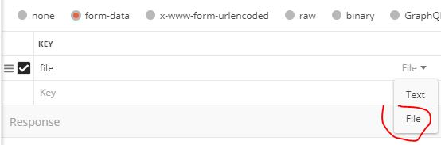
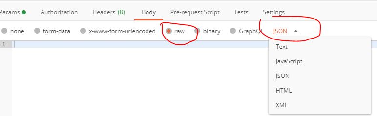
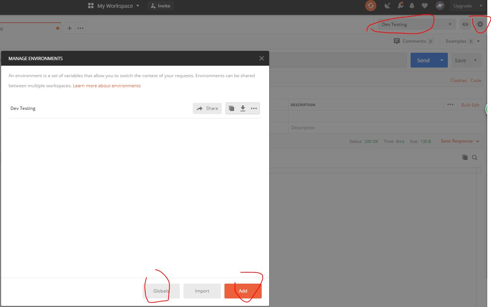
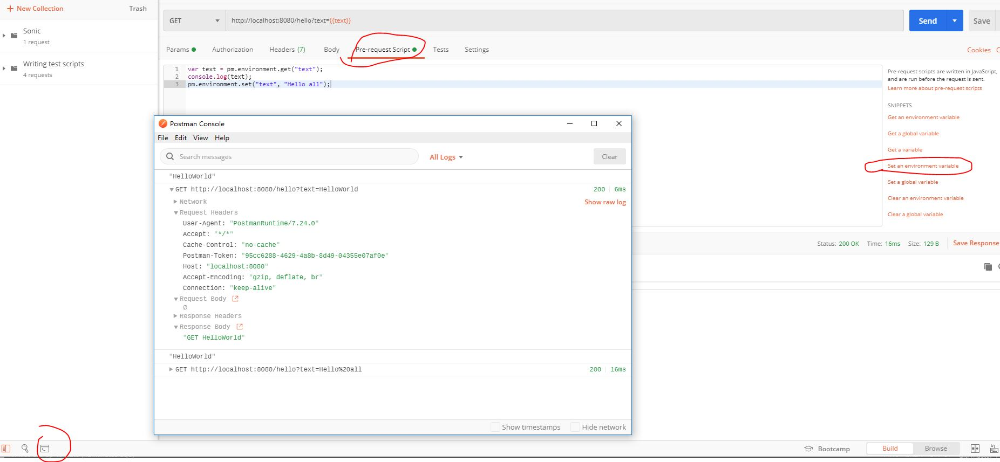
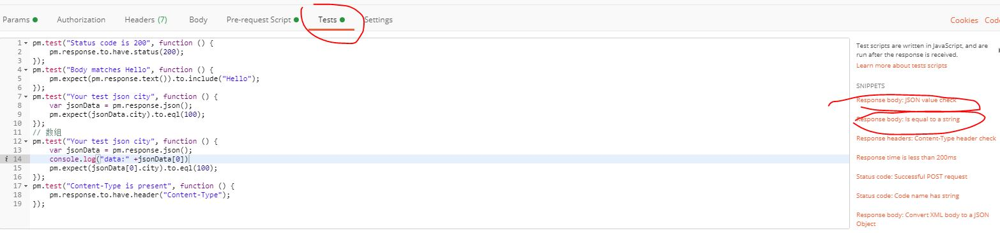
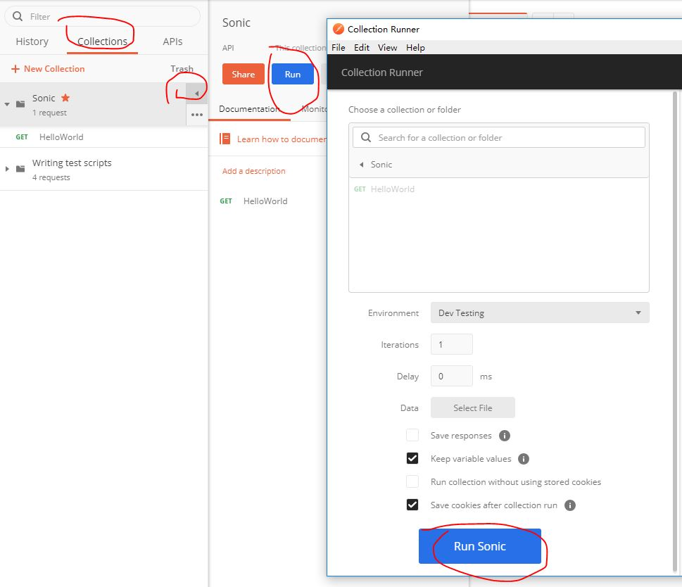
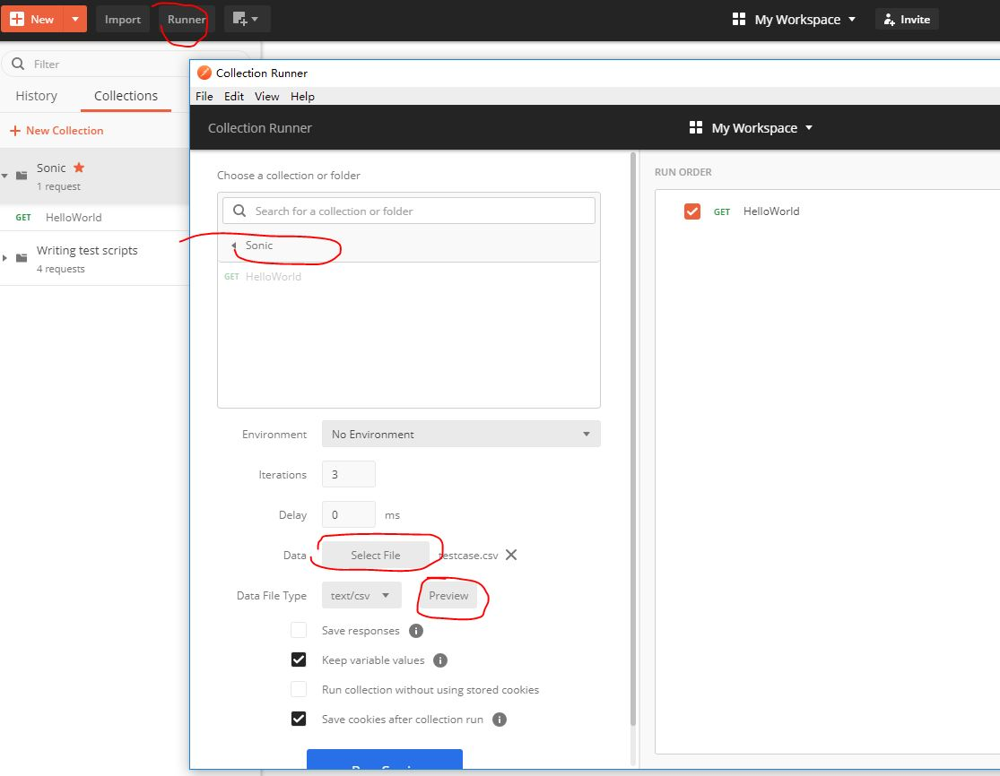
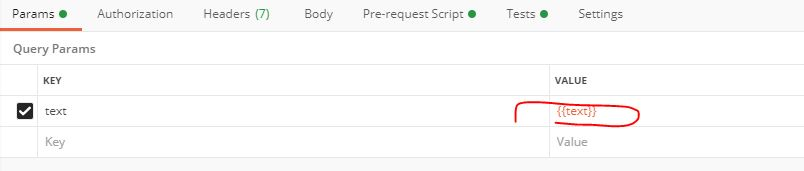

## Postman

### Body
- form-data 提交form表单和上传binary文件，上传文件把key类型选择为file

- x-www-form-urlencoded 提交form表单, 把参数携带在URL中（不可见）
- binary 上传binary文件
- raw 原始文本 （JSON、XML）

### Param

- global 全局变量
- add 局部变量， 覆盖全局变量

### Script

### Test
- 测试的值需要和raw中进行校验（unicode转换）\\转义\

- CSV如果包含中文，需要进行UTF-8转换

- param中使用{{columnName}}

- Tests中获取CSV中的值使用data.columnName

- Cookie

