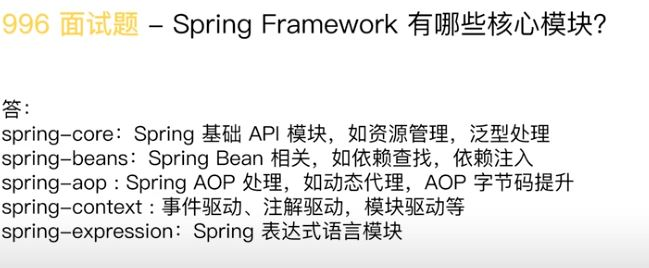
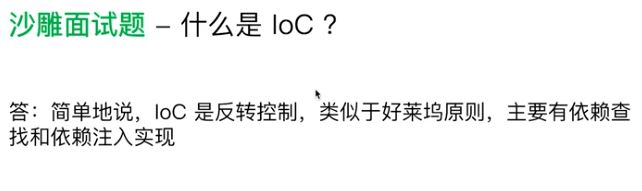

## Spring 核心编程思想

#### Aware
- ApplicationContextAware
- BeanFactoryAware

#### BeanPostProcessor

#### 设计模式
- 观察者模式： SimpleApplicationEventMulticaster#multicastEvent
- 组合模式：CompositeCacheManager.cacheManagers
- 模板方法模式：JdbcTemplate#execute(CallableStatementCreator csc, CallableStatementCallback<T> action),CallableStatementCreator需要实现

#### 代理
- AopProxy
    - CglibAopProxy （依赖asm）
    - JdkDynamicAopProxy

#### 外部化配置
- Environment是多个PropertySource

#### 泛型
- GenericTypeResolver
- ResolvableType
- ParameterizedType

#### Enable
- EnableCaching
- EnableTransactionManagement
- EnableWebMvc

#### Spring 核心价值
- 面向对象编程
- 面向切面编程
- 面向元编程
- 面向模块编程
- 面向函数编程
- OOP
- Ioc/DI
- DDD
- TDD
- EDP
- PF
 
 #### 面试题
 
- core: 资源管理（Resource）, 泛型处理（GenericTypeResolver）
- beans: 依赖查找（BeanFactory），依赖注入（AutowiredAnnotationBeanPostProcessor）
- context：事件驱动（ApplicationEvent）， 注解驱动（Component, ComponentScan），模块驱动（EnableCaching, EnableAspectJAutoProxy）
 
 

#### DI/IoC
- DI是IoC的一种实现方式， 原本是A对象要调用B对象，即主动创建B对象，现在则需要依赖容器去创建B对象，才能调用，属于被动方式
- IoC实现方式：
    - Java Beans
    - Java ServiceLoader SPI
    - JNDI
- Ioc 其实是一种推的模式（通常使用的是拉的模式），观察者模式的扩展都属于Ioc
  
#### Java Beans
- Introspector(自省)  
- PropertyEditorSupport(接口：PropertyEditor)
- 构造注入/Set注入（构造注入：属性申明final，不变对象）
- 依赖查找
    - getBean
    - ObjectFactoryCreatingFactoryBean的createInstance会被反射调用，返回TargetBeanObjectFactory（ObjectFactory），TargetBeanObjectFactory会beanFactory中getBean
    - getBeansOfType 返回同一类型的多个beans
    - getBeansWithAnnotation 通过Annotation获取beans
- 依赖注入
    - `<util:list>`
    - `autowire="byType"`
- bean分类
    - 自定义bean DefaultListableBeanFactory#beanDefinitionMap
    - 容器内建bean DefaultSingletonBeanRegistry#singletonObjects
    - 容器内建依赖（非容器的bean） AbstractApplicationContext#prepareBeanFactory->beanFactory.registerResolvableDependency
- ApplicationContext VS BeanFactory
    - XmlBeanDefinitionReader#loadBeanDefinitions
    - AnnotationConfigApplicationContext#register, refresh
- BeanDefinition
    - Class
    - Name
    - Scope
    - Constructor arguments
    - Properties
    - Autowiring mode
    - Lazy initialization mode
    - Initialization method
    - Destruction method
- BeanNameGenerator

