## Spring Cloud Alibaba

### Alibaba Maven 镜像
- Minor： https://help.aliyun.com/document_detail/102512.html   
- 从aliyun的中央仓库下载
```xml
  <mirror>
    <id>aliyunmaven</id>
    <mirrorOf>central</mirrorOf>
    <name>阿里云公共仓库</name>
    <url>https://maven.aliyun.com/repository/public</url>
  </mirror>
```

### IDEA 快捷键
- Help -> Keymap Reference

### Maven
- Maven过滤掉test -Dmaven.test.skip=true 或 -DskipTests

### YAML
- YAML配置是有序的，而properties配置是无序的

### Spring boot

- Spring boot Initializer
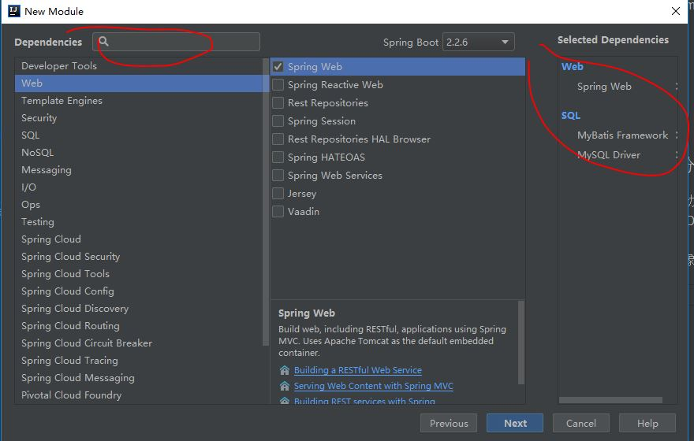

- Runner
    - org.springframework.boot.ApplicationRunner 参数封装为ApplicationArguments
    - org.springframework.boot.CommandLineRunner 可变参数
    
- Actuator
    - management.endpoint.health.show-details=always 显示health详情
    - 在application.properties定义如下，访问info: http://localhost:8080/actuator/info
    ```text
    info.app-name=spring-boot-demo
    info.author=Sonic
    info.email=rock_lee_aya@hotmail.com
    ```
    - 激活所有的Actuator端点 management.endpoints.web.exposure.include=* 如果使用YAML，需要'*'
    - 激活部分的Actuator端点 management.endpoints.web.exposure.include=metrics,health
    - metrics 度量： http://localhost:8080/actuator/metrics http://localhost:8080/actuator/metrics/jvm.memory.max

- jar中没有主清单属性是因为在MENIFEST.MF中没有
    ```text
    Start-Class: com.sonic.demo.ApplicationRunnerBootstrap
    Main-Class: org.springframework.boot.loader.JarLauncher
    ```

- 通过变量启动
    - 传参数
        - 环境变量
            - jar启动 java -jar springbootdemo-0.0.1-SNAPSHOT.jar --var_env=always
            - 通过System.getenv("var_env");获取
            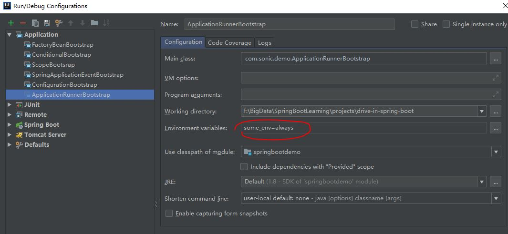
        - 程序参数Program arguments
            - 通过args获取
            - IDEA中模拟环境变量： --env=XXX
        - VM options
            - -Denv=dev
            - 通过System.getProperty("env");获取
    - 配置文件
        - ${env}可以从-Denv或者--env中获取
        - 配置文件中的属性都可以通过-Denv=XXX或者--env=XXX传入，进行设置。比如：-Dserver.port=8081，--server.port=8081 
    
- Profile
    - yaml
        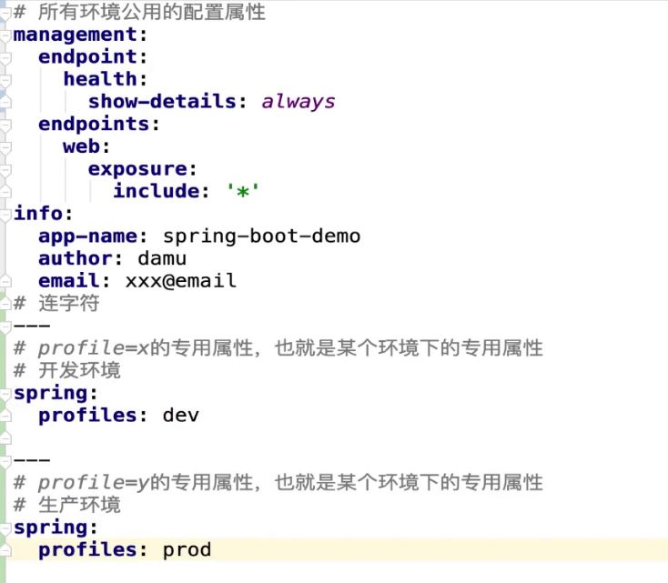
        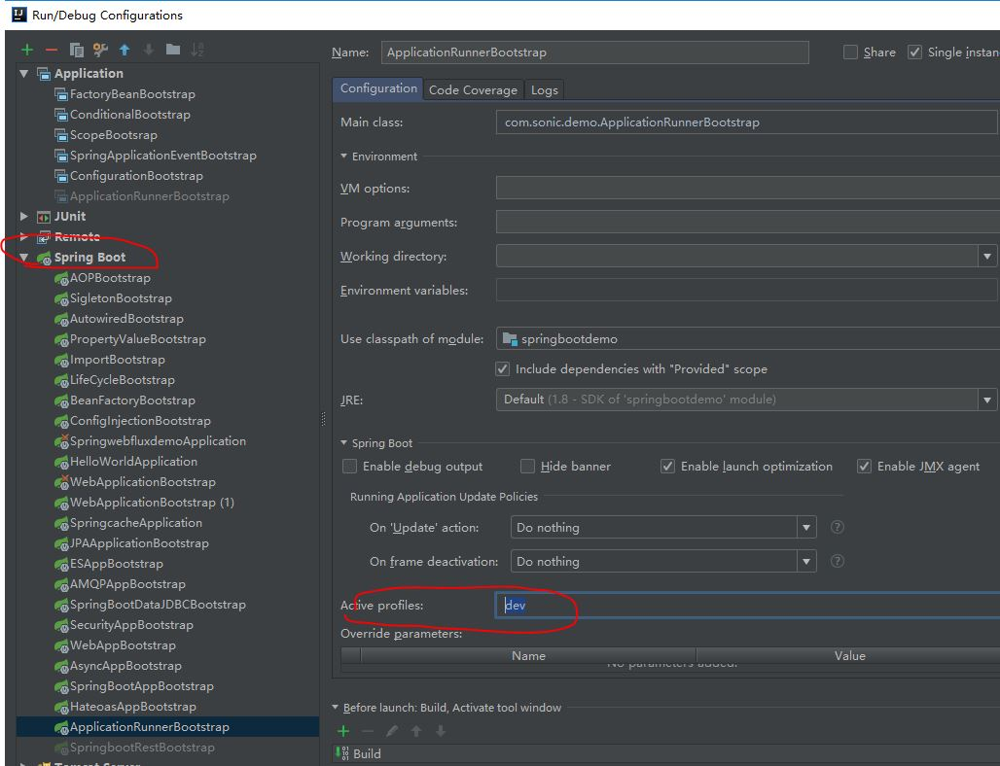
        - 设置默认profile：application.yml中加spring:profiles:active:dev
        - 或者建立多个yaml：application-dev.yml
    - properties
        - 建立多个properties：application-dev.properties
        - 设置默认profile：application.properties中加spring.profiles.active=dev
    - 总结
        - 共用的放在application.XXX中，非共用的放在application-env.XXX中    

- structure
    - domain
        - dto （data transfer object）
        - entity 数据库对应
        - enums 枚举

- @Autowired和@Resource区别： https://blog.csdn.net/weixin_40423597/article/details/80643990
- Intellij IDEA中Mybatis Mapper自动注入警告的6种解决方案：https://www.imooc.com/article/287865

### 服务拆分方法论  
- 领域驱动设计（Domain Driven Design简称DDD）
- 面向对象（by name、by verb）

### 服务拆分
- 职责划分
- 通用性划分

### 数据库
- 测试connection
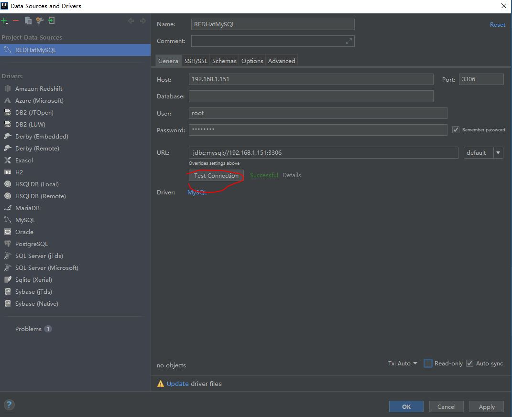
- 创建console
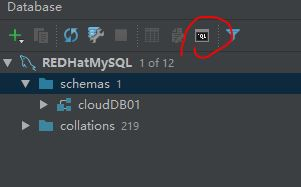

### API文档
https://t.itmuch.com/doc.html

### 注册微信小程序
https://mp.weixin.qq.com/
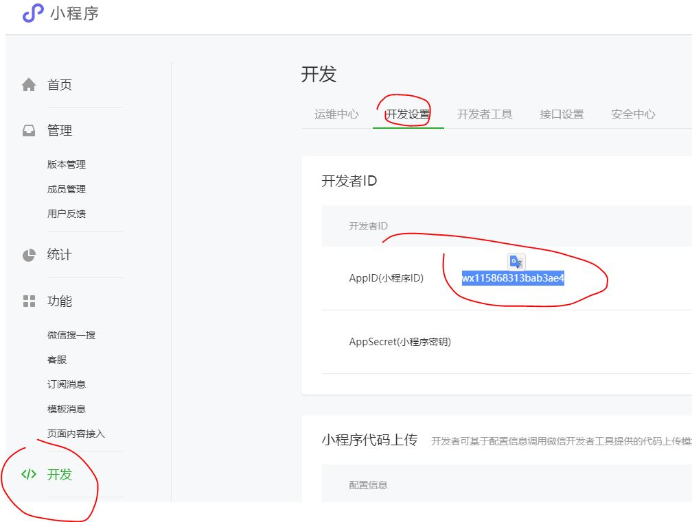

### 前端代码
https://github.com/eacdy/itmuch-miniapp
- 安装nodejs
    - 检测node -v
- 参考 https://github.com/eacdy/itmuch-miniapp

### 通用Mapper （MyBatis 插件）
- https://github.com/abel533/Mapper
- 整合lombok https://github.com/abel533/Mapper/wiki/4.1.mappergenerator
    
### Lombok
- https://projectlombok.org/setup/maven
- 注解
    - @Getter
    - @Setter
    - @ToString
    - @EqualsAndHashCode
    - @NoArgsConstructor 无参构造
    - @AllArgsConstructor 所有参数构造
    - @RequiredArgsConstructor 只对final申明的字段进行构造函数 @RequiredArgsConstructor(onConstructor = @__(@Autowired)) 在构造函数上加@Autowired注解
    - @Builder 建造者模式
    - @Data

### 版本管理
- 语义化版本
    - 主版本 第几代
    - 次版本 功能增加，架构没有变化
    - 增量版本， bug修复
    - snapshot 开发版 -> M 里程碑 -> release 正式版 
- Spring Cloud 版本
    - 伦敦地铁站站名
        - Greenwich release 第一个正式版本 -> SR1版本 发现bug -> SR2版本
        
### 服务发现原理
- 服务消费者和服务提供者本地都维护一个cache，通过定时任务对cache进行更新，从服务发现组件获取到最新的服务列表信息
- 服务消费者和服务提供者都会定时向服务发现组件发送心跳，如果长时间不发送，则服务发现组件会移除这个服务信息
- 服务消费者通过cache获取到服务列表，然后直接调用服务提供者
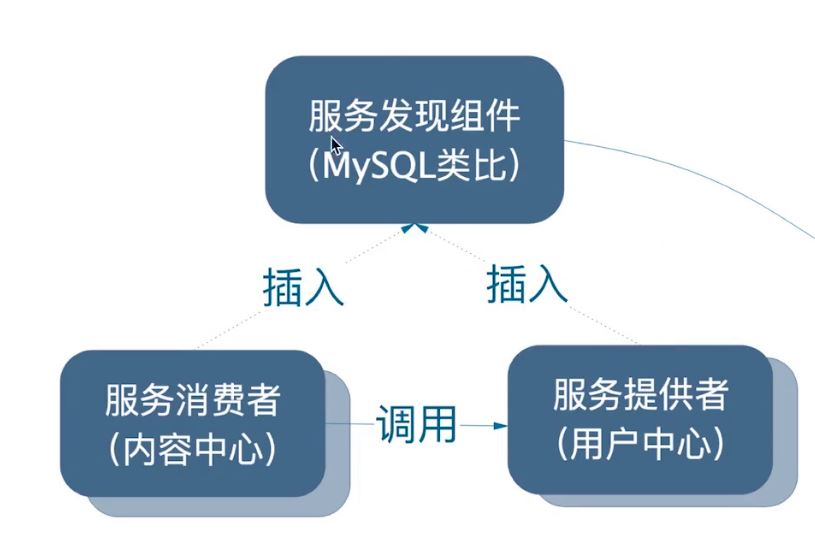

### Nacos
- https://nacos.io/en-us/docs/what-is-nacos.html
- 服务发现组件
- 配置服务器
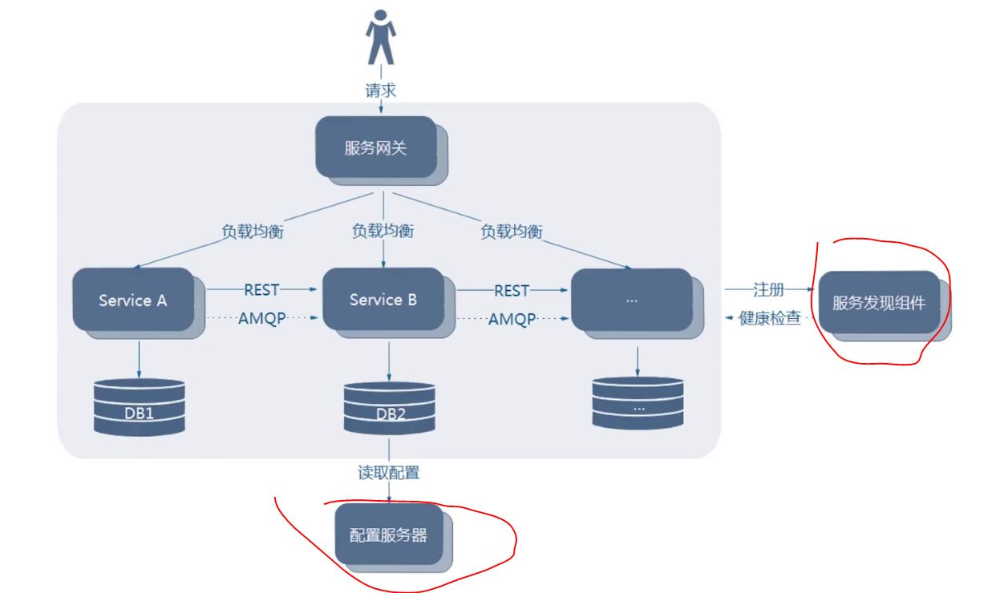
- 搭建Nacos server https://nacos.io/zh-cn/docs/quick-start.html
- Console: http://172.25.43.113:8848/nacos/index.html
- 没有在application.yml中配置spring.application.name，服务名称使用-，不要用_和特殊字符。
```text
2020-04-05 22:51:19.009  WARN 948 --- [           main] o.s.c.a.n.registry.NacosServiceRegistry  : No service to register for nacos client...
```
- 注册成功
```text
2020-04-05 22:56:35.047  INFO 5308 --- [           main] o.s.c.a.n.registry.NacosServiceRegistry  : nacos registry, user-center 172.25.43.113:8081 register finished
```
- 服务发现的领域模型
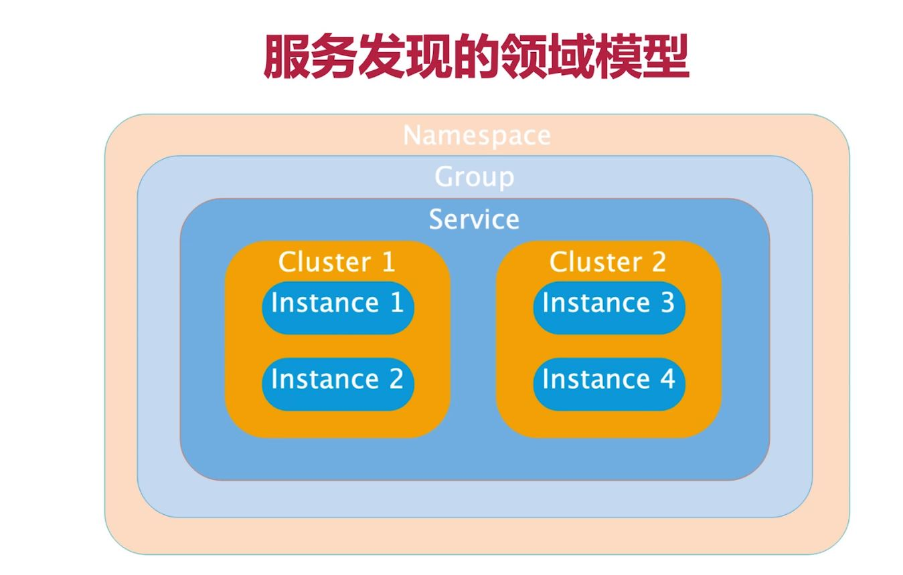
    - Namespace 隔离 dev、uat、prod 默认public， 服务不能跨越namespace调用，不同namespace之间无法调用
    - Group 不同服务可以分到一个组
    - Service 微服务功能划分
    - Cluster 对微服务的虚拟划分：北京cluster 南京cluster
    - Instance 微服务实例

- 元数据
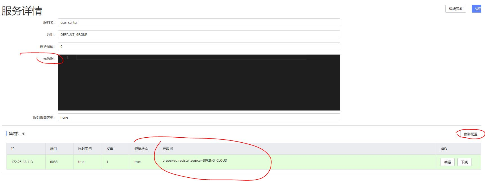

- 步骤
    - https://spring-cloud-alibaba-group.github.io/github-pages/edgware/spring-cloud-alibaba.html
    - 加依赖
    ```xml
        <dependency>
            <groupId>org.springframework.cloud</groupId>
            <artifactId>spring-cloud-starter-alibaba-nacos-discovery</artifactId>
        </dependency>
    ```
    - 改代码 user-center是服务名
    ```text
      ResponseEntity<UserDTO> forEntity = restTemplate.getForEntity("http://user-center/users/{userId}", UserDTO.class, userId);
    ```
    - 加配置
    ```yaml
    spring:
      cloud:
        nacos:
          discovery:
            server-addr: localhost:8848
            metadata:
              instance: c
              haha: hehe    
      application:
        name: user-center
    ```

### Ribbon
- org.springframework.cloud.netflix.ribbon.RibbonAutoConfiguration
- 负载均衡
    - 服务端负载均衡
    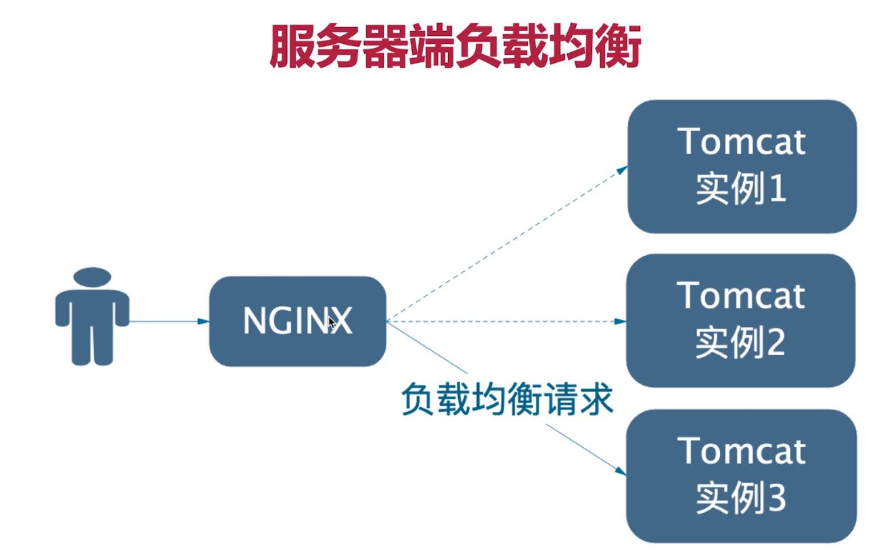
    - 客户端负载均衡
    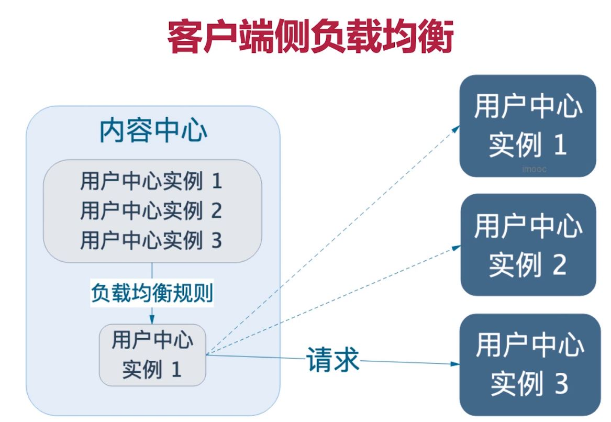
- ribbon
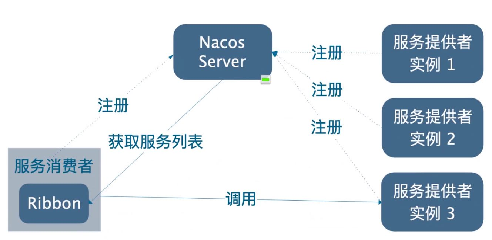   
- 坑
    - ribbonconfiguration.RibbonConfiguration
    - Ribbon轮训策略的配置类一定要放在主上下文之外，只让Ribbon上下文扫描到，才能对每个service进行独立配置。如果被主上下文扫描到，则会导致所有service都使用同一个策略配置。
    - https://cloud.spring.io/spring-cloud-static/Greenwich.SR5/single/spring-cloud.html
        - 16.2 Customizing the Ribbon Client
        - 16.4 Customizing the Ribbon Client by Setting Properties

- 步骤
    - 加依赖
        - Nacos已经包含Ribbon jar
    - 加注解
        - @LoadBalanced 使用loadbalancer
        - 全局 @RibbonClients(defaultConfiguration = RibbonConfiguration.class)
        - 个性 @RibbonClient(name = "user-center", configuration = RibbonConfiguration.class)
                - RibbonConfiguration.class不能被spring的上下文扫描到
    - 加配置
        - 个性 
        ```yaml
        user-center:
          ribbon:
            NFLoadBalancerRuleClassName: com.netflix.loadbalancer.RandomRule
        ```
- 懒加载
    - 当restTemplate.getForEntity("http://user-center/users/{userId}", UserDTO.class, userId);被调用才会创建ribbon client
    - 16.9 Caching of Ribbon Configuration
- Ribbon支持Nacos权重
    - http://www.imooc.com/article/288660

### Feign
- 申明式HTTP客户端
    - 增加依赖
    - 写接口
    - 增加注解
        - @EnableFeignClients
        - @FeignClient(name = "user-center") 
- 源码
    - LoadBalancerFeignClient （和Ribbon结合使用）
    - feign.Client.Default （不和Ribbon结合使用）
- 日志
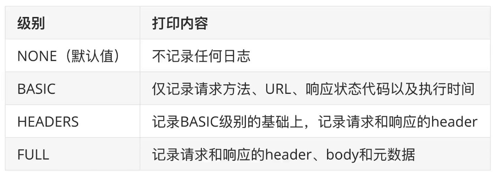
    - 在Feign client configuration注入Logger.Level.FULL的bean
    - Feign client日志定义为debug com.sonic.contentcenter.feignclient.UserCenterFeignClient: debug
    - **坑**：如果在Feign client configuration增加@Configuration，就必须放在ComponentScan之外，否则会对所有client生效
        - 估计原理：
            - 通过@FeignClient(name = "user-center", configuration = UserCenterFeignConfiguration.class)的configuration指定，单个client已经可以在子容器找到对应的configuration。
            - 如果增加了@Configuration，则会被parent上下文优先扫到，则作为父容器的bean，所有的client都会使用这个配置


